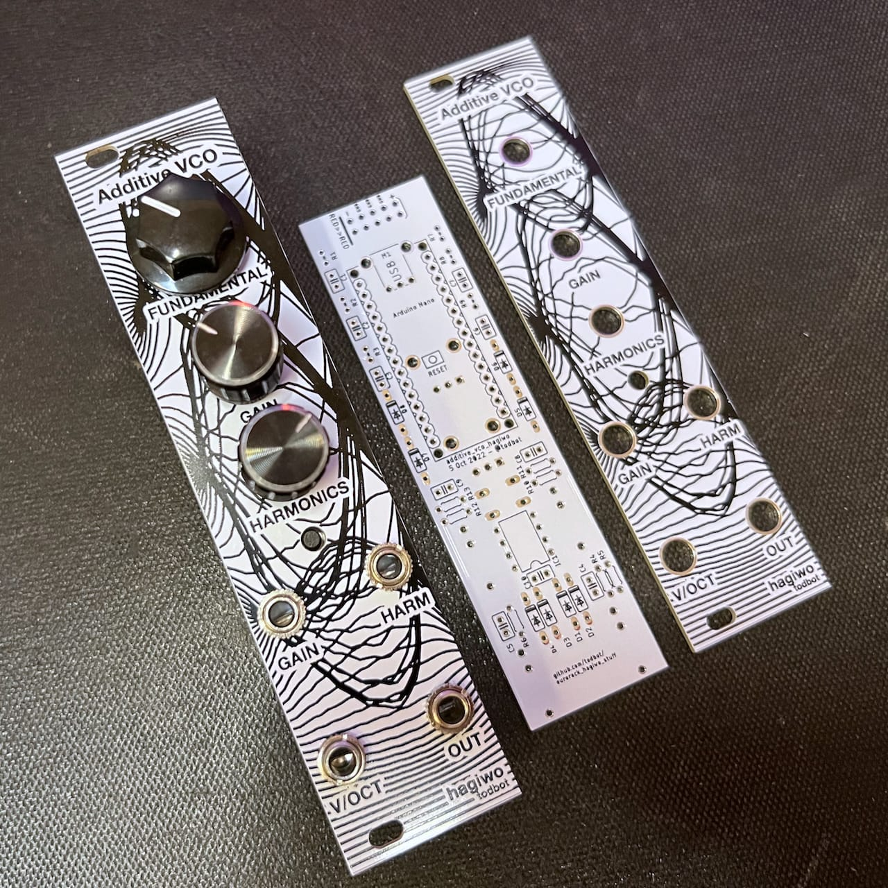
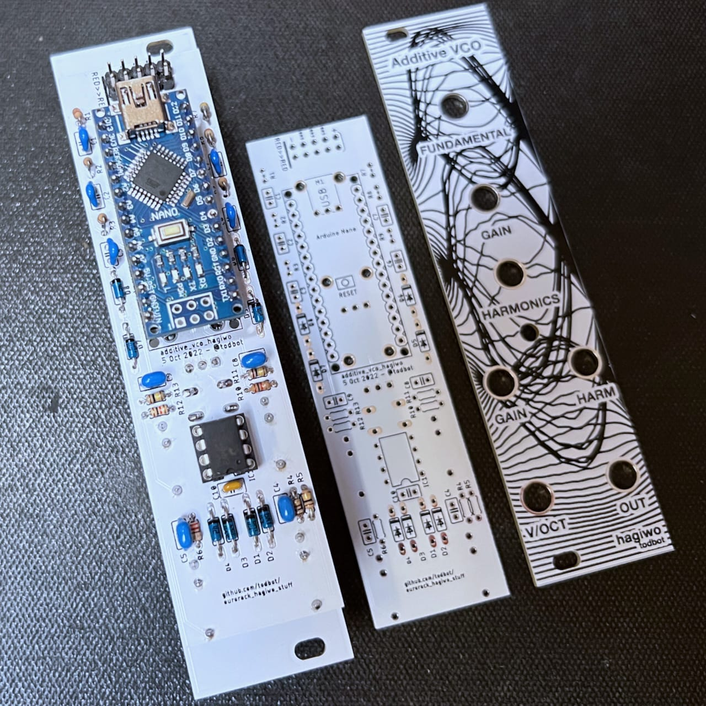

# eurorack_hagiwo_stuff

So far just a PCB version of ["additive_vco"](https://note.com/solder_state/n/n30b3a8737b1e)

Here's a little demo video of it in action:

https://user-images.githubusercontent.com/274093/197077549-f81a2e05-508c-4a3f-a483-26bdcd0a558a.mp4

